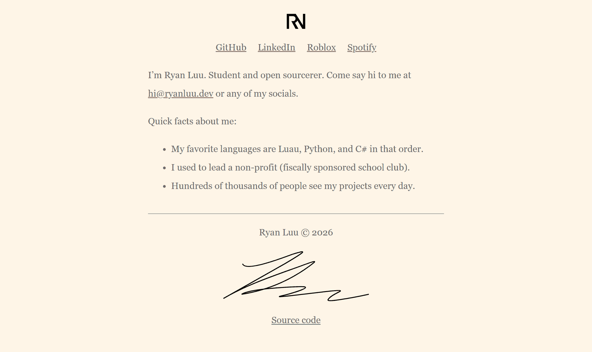

# [Personal Website](https://ryanluu.dev)

> [ryanluu.dev](https://ryanluu.dev)

Source code for my personal website at [ryanluu.dev](https://ryanluu.dev). Completely static and made in HTML and CSS with no JavaScript or dependencies.

* Dark and light color theme
* SVG and AVIF for images
* Web safe fonts

You can find the source code in the [`docs`](docs) directory. The site is hosted using [GitHub Pages](http://pages.github.com). [Biome](https://biomejs.dev/) is used for linting and formatting.

###### Not a secret, but [my GPG key is hosted on my website](https://ryanluu.dev/public.asc)!
